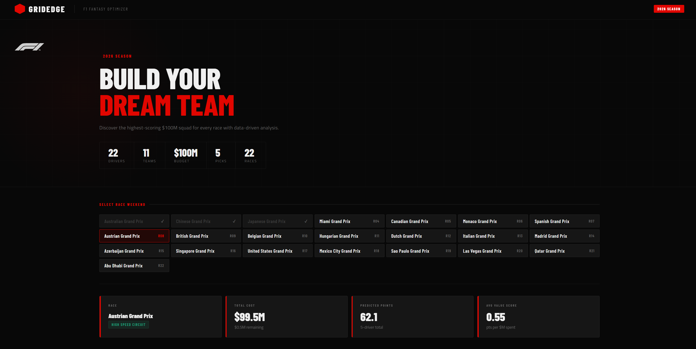
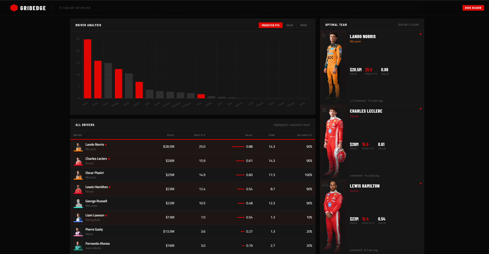

# ⬡ GridEdge — F1 Fantasy Team Optimizer

> **LightGBM predictions + Integer Linear Programming to build your optimal $100M F1 Fantasy squad — updated every race weekend.**


---

## What is GridEdge?

GridEdge is a full-stack machine learning application that helps F1 Fantasy players pick their optimal team for every race weekend. It ingests real race data via the FastF1 API, engineers 5 predictive features per driver, trains a LightGBM regression model on a rolling window of recent races, and solves a binary ILP to find the highest-scoring 5-driver squad within the $100M budget constraint.

The web interface (Flask + Chart.js) lets you select any of the 22 races on the 2026 calendar, instantly rendering predictions, driver analytics, feature importances, and your recommended team.

---

## Demo

 


> Run locally in under 2 minutes — see [Quick Start](#quick-start).

---

## Architecture

```
FastF1 API
    │
    ▼
src/ingest.py          ← Stage 1 & 2: Fetch race results + fuzzy-merge prices
    │
    ▼
src/features.py        ← Stage 3: Engineer 5 rolling features per driver × race
    │
    ▼
src/model.py           ← Stage 4: Train LightGBM (rolling 30-race window)
    │
    ▼
src/optimizer.py       ← Stage 5: ILP via PuLP (CBC) → max predicted pts, ≤ $100M
    │
    ▼
app.py                 ← Flask API + self-contained HTML/JS dashboard
```

The pipeline is fully orchestrated by `run_pipeline.py` and can retrain automatically every Tuesday via `weekly_retrain.py` + `schedule_config.py`.

---

## Features

**Machine Learning**
- **LightGBM regressor** trained on rolling windows of recent races — avoids distribution shift from stale seasons
- **5 engineered features**: recent form (last 3 races), position consistency (std over last 5), qualifying position, DNF rate (last 10 races), team momentum
- **Ensemble predictions** in weekly retrain mode: 40% model + 30% recent form + 30% price efficiency
- **Incremental training**: fetches only new races since last run — no redundant API calls

**Optimisation**
- **Exact ILP** formulation via PuLP / CBC solver: binary decision variables, budget ≤ $100M, exactly 5 drivers
- **Automatic fallback** to `scipy.optimize.milp` if PuLP/CBC is unavailable
- Sanity-checked after every retrain (prediction range, variance guard)

**Web Dashboard**
- Race selector across all 22 rounds of the 2026 calendar
- Live KPI cards: total cost, predicted points, budget remaining, avg value score
- Switchable Chart.js bar chart (predicted pts / value score / price)
- Full driver table with value bars, form, and reliability columns
- Optimal team panel with team-colour stripes and LightGBM rationale snippets
- Feature importance visualisation
- Circuit type tagging (Street / Technical / High Speed)

**MLOps**
- Weekly scheduled retraining: Windows Task Scheduler (`--install`) or cross-platform Python daemon (`--daemon`)
- Historical backtesting via `validate_weekly.py`: walk-forward validation on the last 8 races of any season, comparing model vs. naïve (most-expensive) baseline
- Structured logging to `logs/weekly_retrain.log`
- Docker + Docker Compose for one-command deployment

---

## Quick Start

### 1. Clone & install

```bash
git clone https://github.com/<your-username>/grid-edge.git
cd grid-edge
pip install -r requirements.txt
```

### 2. Run the full pipeline (fetches real FastF1 data)

```bash
python run_pipeline.py --real-data
```

This fetches race results for 2022–2026, engineers features, trains the model, and saves `models/lgbm_model.pkl`.

### 3. Launch the dashboard

```bash
python app.py
# → http://localhost:5000
```

Select a race weekend and GridEdge will return your optimal team in under a second.

---

## Docker

```bash
# Build and run
docker compose up --build

# App available at http://localhost:5000
```

The Compose file mounts `data/`, `models/`, and `logs/` as volumes so your trained model and cached data persist across container restarts.

---

## Pipeline Reference

| Script | Purpose |
|---|---|
| `run_pipeline.py` | Full pipeline: ingest → features → train → evaluate |
| `weekly_retrain.py` | Incremental retrain on latest races + team prediction |
| `validate_weekly.py` | Walk-forward backtest vs. naïve baseline |
| `schedule_config.py` | Install/manage weekly Task Scheduler or daemon |
| `src/ingest.py` | FastF1 fetcher + fuzzy price merge (rapidfuzz) |
| `src/features.py` | Rolling feature engineering across season boundaries |
| `src/model.py` | LightGBM training with rolling-window lookback |
| `src/optimizer.py` | PuLP ILP → optimal 5-driver team |
| `app.py` | Flask API + full frontend in a single file |

### Key CLI flags

```bash
# Skip re-fetching data (re-train on existing features.csv)
python run_pipeline.py --skip-ingest

# Weekly mode: incremental fetch + 12-race lookback
python run_pipeline.py --real-data --weekly

# Force re-download all historical data
python run_pipeline.py --real-data --force-refresh

# Schedule automatic retraining (Windows)
python schedule_config.py --install

# Cross-platform daemon
python schedule_config.py --daemon

# Backtest the approach
python validate_weekly.py
```

---

## Feature Engineering

Five features are computed per driver per race using rolling windows that span season boundaries:

| Feature | Description | Window |
|---|---|---|
| `recent_form_pts` | Average fantasy points | Last 3 races |
| `position_std` | Standard deviation of finishing positions | Last 5 races |
| `qual_position` | Qualifying grid position (lower = better) | Current race |
| `dnf_rate` | Proportion of races with 0 points | Last 10 races |
| `team_momentum` | Team's average fantasy points | Last 3 races |

Circuit types (Street / Technical / High Speed) are classified per event and exposed via the API for contextual display in the UI.

---

## Model Details

- **Algorithm**: `LGBMRegressor` — gradient boosted trees
- **Hyperparameters**: 200 estimators, lr=0.1, 15 leaves, min_child_samples=5
- **Training strategy**: Rolling window (default 30 races) to weight recent performance
- **Target**: Fantasy points per race (proxied from championship points)
- **Serialisation**: `pickle` → `models/lgbm_model.pkl`

Weekly retraining uses a 12-race lookback by default to prioritise current-season form, with a 40/30/30 ensemble blending model output with recent form and price efficiency signals.

---

## Project Structure

```
grid-edge/
├── app.py                  # Flask app + full HTML/JS frontend
├── run_pipeline.py         # End-to-end pipeline runner
├── weekly_retrain.py       # Weekly incremental retrain system
├── validate_weekly.py      # Walk-forward backtester
├── schedule_config.py      # Task Scheduler / daemon setup
├── requirements.txt
├── Dockerfile
├── docker-compose.yml
├── src/
│   ├── ingest.py           # FastF1 data ingestion + price merge
│   ├── features.py         # Feature engineering
│   ├── model.py            # LightGBM training
│   └── optimizer.py        # PuLP ILP optimizer
├── data/
│   ├── prices.csv          # Driver prices for current season
│   ├── race_data.csv       # Raw race results cache
│   ├── merged_data.csv     # Race + price merged dataset
│   └── features.csv        # Engineered feature matrix
└── models/
    └── lgbm_model.pkl      # Trained model
```

---

## Stack

| Layer | Technology |
|---|---|
| Data ingestion | [FastF1](https://github.com/theOehrly/Fast-F1) |
| Name matching | [rapidfuzz](https://github.com/maxbachmann/RapidFuzz) |
| ML model | [LightGBM](https://lightgbm.readthedocs.io/) |
| Optimisation | [PuLP](https://coin-or.github.io/pulp/) (CBC solver) + scipy fallback |
| Web framework | Flask 3.0 |
| Frontend charts | Chart.js 4.4 |
| Scheduling | Windows Task Scheduler / Python `schedule` |
| Containerisation | Docker + Compose |

---

## Roadmap

- [ ] Tyre strategy and safety car probability features
- [ ] Multi-race team lock constraints
- [ ] Turbo driver (2× points) selection
- [ ] Live price updates via F1 Fantasy API scraper
- [ ] PostgreSQL backend for prediction history and tracking
- [ ] CI/CD pipeline with automated weekly retrain

---

## Contributing

Pull requests are welcome. For significant changes, please open an issue first to discuss what you'd like to change. Make sure to update tests and run `validate_weekly.py` before submitting.

---

## License

MIT — see `LICENSE` for details.

---

<p align="center">Built with FastF1 · LightGBM · PuLP ILP · 2026 Season · 22 Races</p>
